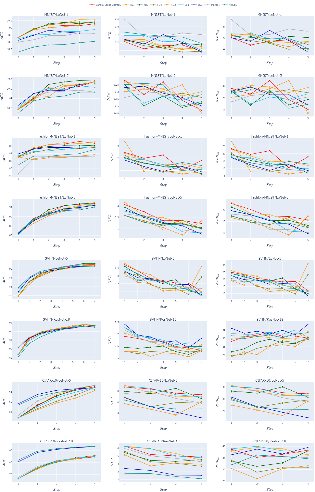
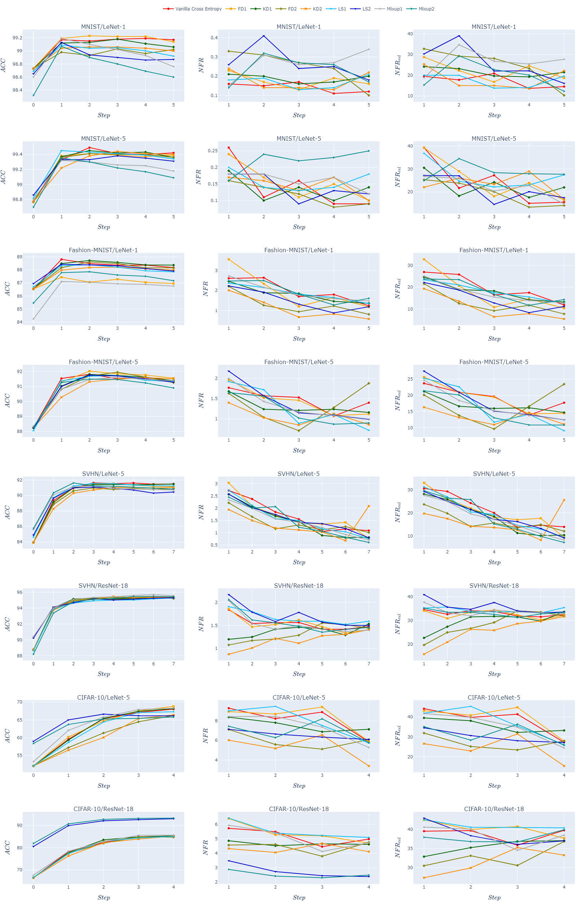

Deep learning (DL) models have been widely employed in a variety of application domains. While DL models are continuously evolving to achieve better predictive performance, regression (i.e., a test sample that was correctly predicted by the old DL model is incorrectly predicted by the new DL model) is also introduced. However, little is known about the regression in DL model evolution across datasets and models; e.g., how severe is the regression problem in DL model evolution? how test input selection, which is often adopted to guide DL model evolution, affects regression? and how effective are existing techniques in reducing regression in DL model evolution? 

To fill the above knowledge gap, we present a large-scale empirical study with four datasets, three DNN models, seven state-of-the-art test input selection techniques, and four state-of-the-art regression reduction techniques to characterize the regression in DL model evolution. We find that i) regression is quite prevalent in DL model evolution across datasets and models, and it often overshadows the improved accuracy; ii) uncertainty-based test input selection techniques improve accuracy in DL model evolution, but also bring more regression problems; and iii) existing regression reduction techniques are not always effective in reducing regression, and usually have a tradeoff in reducing regression and improving performance. Our findings provide practical implications to test input selection and regression reduction in DL model evolution.

**This website is where we present experimental detailed results and implementation source code of our study.**

## Research Questions
* **RQ1: Severity Analysis.** What is the severity of the regression problem in **_trivial_** DL model evolution?
* **RQ2: Impact Analysis of TS.** What is the impact of using test input selection in **_guided_** DL model evolution on regression?
* **RQ3: Mitigation Analysis.** What is the effectiveness of existing techniques in reducing regression in DL model evolution?

## Detailed Results
### RQ1
Detailed result of $$Accuracy$$ in trivial DL model evolution:

|  Dataset  | MNIST   |        |        |         |        |        | Fashion-MNIST |        |        |         |        |        |
| DNN Model | LeNet-1 |        |        | LeNet-5 |        |        | LeNet-1       |        |        | LeNet-5 |        |        |
|    Seq    |    #1   |   #2   |   #3   |    #1   |   #2   |   #3   |       #1      |   #2   |   #3   |    #1   |   #2   |   #3   |
|:---------:|---------|--------|--------|---------|--------|--------|---------------|--------|--------|---------|--------|--------|
|   Step 0  |  98.20  | 98.48  | 98.17  |  98.41  | 98.52  | 98.27  |     85.09     | 86.73  | 85.11  |  87.21  | 87.15  | 87.16  |
|   Step 1  |  98.31  | 98.95  | 98.62  |  99.00  | 98.97  | 98.89  |     87.17     | 87.51  | 86.13  |  88.96  | 88.54  | 89.22  |
|   Step 2  |  98.58  | 99.02  | 98.78  |  99.21  | 99.12  | 99.09  |     87.59     | 87.85  | 86.49  |  89.86  | 89.82  | 90.45  |
|   Step 3  |  98.70  | 99.07  | 98.90  |  99.20  | 99.26  | 99.21  |     87.95     | 88.22  | 87.60  |  90.62  | 90.36  | 90.67  |
|   Step 4  |  98.65  | 99.03  | 98.93  |  99.24  | 99.32  | 99.23  |     88.03     | 88.29  | 87.91  |  90.76  | 90.63  | 91.00  |
|   Step 5  |  98.74  | 99.12  | 98.94  |  99.30  | 99.35  | 99.28  |     87.93     | 88.20  | 88.08  |  90.97  | 91.18  | 90.99  |

|  Dataset  | SVHN    |        |        |           |        |        | CIFAR-10 |        |        |           |        |        |
| DNN Model | LeNet-5 |        |        | ResNet-18 |        |        | LeNet-5  |        |        | ResNet-18 |        |        |
|    Seq    |    #1   |   #2   |   #3   |     #1    |   #2   |   #3   |    #1    |   #2   |   #3   |     #1    |   #2   |   #3   |
|:---------:|---------|--------|--------|---------|--------|--------|---------------|--------|--------|---------|--------|--------|
|   Step 0  |  83.45  | 84.10  | 83.92  |   85.18   | 86.59  | 85.73  |  53.84   | 53.02  | 52.38  |   65.88   | 64.37  | 63.15  |
|   Step 1  |  86.65  | 87.74  | 86.84  |   91.46   | 92.36  | 90.80  |  58.21   | 57.88  | 57.29  |   74.51   | 72.06  | 72.55  |
|   Step 2  |  88.22  | 88.94  | 88.60  |   93.06   | 93.76  | 92.37  |  60.85   | 61.15  | 59.53  |   78.58   | 77.51  | 77.63  |
|   Step 3  |  89.17  | 89.91  | 89.31  |   94.03   | 94.33  | 93.52  |  62.98   | 63.27  | 62.63  |   81.48   | 81.37  | 81.70  |
|   Step 4  |  89.78  | 90.09  | 90.11  |   94.55   | 94.76  | 94.04  |  64.40   | 64.42  | 64.70  |   84.28   | 84.13  | 84.14  |
|   Step 5  |  89.85  | 90.18  | 90.12  |   94.81   | 95.05  | 94.65  |     -    |    -   |    -   |     -     |    -   |    -   |
|   Step 6  |  90.21  | 90.55  | 90.12  |   95.16   | 95.30  | 95.05  |     -    |    -   |    -   |     -     |    -   |    -   |
|   Step 7  |  90.40  | 90.57  | 90.59  |   95.26   | 95.46  | 95.08  |     -    |    -   |    -   |     -     |    -   |    -   |

Detailed result of $$NFR$$ in trivial DL model evolution:

|  Dataset  | MNIST   |       |       |         |       |       | Fashion-MNIST |       |       |         |       |       |
| DNN Model | LeNet-1 |       |       | LeNet-5 |       |       | LeNet-1       |       |       | LeNet-5 |       |       |
|    Seq    |    #1   |   #2  |   #3  |    #1   |   #2  |   #3  |       #1      |   #2  |   #3  |    #1   |   #2  |   #3  |
|:---------:|---------|--------|--------|---------|--------|--------|---------------|--------|--------|---------|--------|--------|
|   Step 1  | 0.58    | 0.16  | 0.28  | 0.20    | 0.23  | 0.14  | 2.53          | 1.57  | 1.58  | 1.49    | 2.05  | 1.61  |
|   Step 2  | 0.32    | 0.23  | 0.30  | 0.09    | 0.22  | 0.14  | 1.80          | 1.49  | 1.60  | 1.26    | 1.12  | 1.09  |
|   Step 3  | 0.25    | 0.13  | 0.20  | 0.18    | 0.15  | 0.12  | 1.25          | 1.10  | 1.64  | 1.05    | 1.14  | 1.02  |
|   Step 4  | 0.33    | 0.16  | 0.27  | 0.21    | 0.14  | 0.15  | 1.20          | 1.01  | 1.68  | 1.10    | 1.08  | 0.90  |
|   Step 5  | 0.13    | 0.13  | 0.35  | 0.10    | 0.15  | 0.13  | 1.46          | 0.95  | 1.22  | 0.92    | 0.66  | 0.76  |

|  Dataset  | SVHN    |       |       |           |       |       | CIFAR-10 |       |       |           |       |       |
| DNN Model | LeNet-5 |       |       | ResNet-18 |       |       | LeNet-5  |       |       | ResNet-18 |       |       |
|    Seq    |    #1   |   #2  |   #3  |     #1    |   #2  |   #3  |    #1    |   #2  |   #3  |     #1    |   #2  |   #3  |
|:---------:|---------|--------|--------|---------|--------|--------|---------------|--------|--------|---------|--------|--------|
|   Step 1  | 2.33    | 2.22  | 2.20  | 2.01      | 1.89  | 1.94  | 6.99     | 7.08  | 6.77  | 5.80      | 6.82  | 7.01  |
|   Step 2  | 2.00    | 1.64  | 1.63  | 1.77      | 1.70  | 2.00  | 6.51     | 6.35  | 6.91  | 5.84      | 5.69  | 5.64  |
|   Step 3  | 1.78    | 1.30  | 1.43  | 1.54      | 1.70  | 1.67  | 5.64     | 6.02  | 6.15  | 5.14      | 4.96  | 4.66  |
|   Step 4  | 1.42    | 1.17  | 1.18  | 1.47      | 1.58  | 1.69  | 5.70     | 5.49  | 6.32  | 4.19      | 4.49  | 4.64  |
|   Step 5  | 1.39    | 2.16  | 1.44  | 1.51      | 1.43  | 1.60  |     -    |   -   |   -   |     -     |   -   |   -   |
|   Step 6  | 1.06    | 2.11  | 2.29  | 1.33      | 1.46  | 1.52  |     -    |   -   |   -   |     -     |   -   |   -   |
|   Step 7  | 0.97    | 1.97  | 1.54  | 1.44      | 1.32  | 1.46  |     -    |   -   |   -   |     -     |   -   |   -   |

Detailed result of $$NFR_{rel}$$ in trivial DL model evolution:

|  Dataset  | MNIST   |        |        |         |        |        | Fashion-MNIST |        |        |         |        |        |
| DNN Model | LeNet-1 |        |        | LeNet-5 |        |        | LeNet-1       |        |        | LeNet-5 |        |        |
|    Seq    |    #1   |   #2   |   #3   |    #1   |   #2   |   #3   |       #1      |   #2   |   #3   |    #1   |   #2   |   #3   |
|:---------:|---------|--------|--------|---------|--------|--------|---------------|--------|--------|---------|--------|--------|
|   Step 1  | 34.95   | 15.47  | 20.67  | 20.32   | 22.67  | 12.83  | 23.17         | 14.49  | 13.38  | 15.48   | 20.53  | 17.14  |
|   Step 2  | 22.92   | 23.72  | 24.93  | 11.51   | 25.26  | 15.56  | 16.64         | 14.01  | 13.75  | 13.97   | 12.43  | 12.79  |
|   Step 3  | 19.51   | 14.12  | 18.41  | 22.68   | 20.45  | 15.33  | 11.84         | 10.63  | 15.29  | 12.46   | 13.17  | 12.09  |
|   Step 4  | 24.77   | 16.65  | 25.51  | 27.85   | 20.74  | 19.64  | 11.40         | 9.78   | 15.86  | 13.14   | 12.76  | 11.03  |
|   Step 5  | 10.46   | 14.92  | 33.38  | 14.40   | 23.23  | 18.20  | 13.74         | 9.12   | 11.64  | 11.23   | 8.26   | 9.27   |

|  Dataset  | SVHN    |       |       |           |       |       | CIFAR-10 |       |       |           |       |       |
| DNN Model | LeNet-5 |       |       | ResNet-18 |       |       | LeNet-5  |       |       | ResNet-18 |       |       |
|    Seq    |    #1   |   #2  |   #3  |     #1    |   #2  |   #3  |    #1    |   #2  |   #3  |     #1    |   #2  |   #3  |
|:---------:|---------|-------|-------|-----------|-------|-------|----------|-------|-------|-----------|-------|-------|
|   Step 1  | 20.93   | 21.57 | 19.89 | 27.57     | 28.55 | 24.59 | 31.07    | 31.70 | 30.26 | 34.54     | 37.92 | 40.44 |
|   Step 2  | 19.57   | 16.94 | 16.46 | 27.95     | 29.47 | 28.88 | 28.57    | 28.24 | 29.80 | 36.59     | 35.11 | 34.75 |
|   Step 3  | 18.62   | 14.47 | 15.13 | 27.78     | 32.03 | 28.00 | 25.04    | 26.80 | 27.64 | 35.32     | 34.35 | 32.80 |
|   Step 4  | 15.59   | 13.15 | 13.40 | 28.63     | 31.92 | 30.26 | 25.42    | 24.39 | 28.59 | 32.71     | 34.77 | 35.81 |
|   Step 5  | 15.26   | 24.40 | 16.22 | 30.77     | 30.54 | 31.83 |     -    |   -   |   -   |     -     |   -   |   -   |
|   Step 6  | 12.10   | 24.80 | 25.67 | 29.02     | 32.60 | 32.40 |     -    |   -   |   -   |     -     |   -   |   -   |
|   Step 7  | 11.22   | 23.09 | 18.12 | 31.91     | 30.51 | 31.23 |     -    |   -   |   -   |     -     |   -   |   -   |

### RQ2
The impact of test input selection techniques on $$Accuracy$$:

|                          | $$MaxP$$ | $$Margin$$ | $$Entropy$$ | $$DeepGini$$ | $$MCP$$ | $$KL_p$$ | $$Var_p$$ | $$Random$$ |
|--------------------------|----------|------------|-------------|--------------|---------|----------|-----------|------------|
| MNIST/LeNet-1 #1         | 98.61    | 98.61      | 98.48       | 98.62        | 98.62   | 98.62    | 98.64     | 98.53      |
| MNIST/LeNet-1 #2         | 99.03    | 99.01      | 99.01       | 99.03        | 99.03   | 99.03    | 99.00     | 98.95      |
| MNIST/LeNet-1 #3         | 98.89    | 98.91      | 98.92       | 98.87        | 98.91   | 98.93    | 98.87     | 98.72      |
| MNIST/LeNet-5 #1         | 99.18    | 99.16      | 99.19       | 99.18        | 99.16   | 99.16    | 99.17     | 99.06      |
| MNIST/LeNet-5 #2         | 99.20    | 99.19      | 99.17       | 99.17        | 99.23   | 99.19    | 99.18     | 99.09      |
| MNIST/LeNet-5 #3         | 99.16    | 99.17      | 99.18       | 99.16        | 99.18   | 99.15    | 99.12     | 99.00      |
| Fashion-MNIST/LeNet-1 #1 | 87.74    | 87.60      | 87.64       | 87.59        | 87.82   | 87.79    | 87.65     | 87.29      |
| Fashion-MNIST/LeNet-1 #2 | 87.84    | 87.86      | 87.98       | 87.82        | 87.94   | 87.59    | 87.59     | 87.80      |
| Fashion-MNIST/LeNet-1 #3 | 87.33    | 87.52      | 87.45       | 87.39        | 87.16   | 87.81    | 86.52     | 86.89      |
| Fashion-MNIST/LeNet-5 #1 | 90.23    | 90.28      | 90.34       | 90.28        | 90.12   | 90.16    | 90.24     | 89.73      |
| Fashion-MNIST/LeNet-5 #2 | 90.39    | 90.31      | 90.35       | 90.39        | 90.18   | 90.29    | 90.37     | 89.61      |
| Fashion-MNIST/LeNet-5 #3 | 90.51    | 90.49      | 90.52       | 90.48        | 90.30   | 90.46    | 90.53     | 89.92      |
| SVHN/LeNet-5 #1          | 89.59    | 89.39      | 89.37       | 89.40        | 89.38   | 89.55    | 89.53     | 88.47      |
| SVHN/LeNet-5 #2          | 89.20    | 89.29      | 89.87       | 89.53        | 89.87   | 89.84    | 89.91     | 89.01      |
| SVHN/LeNet-5 #3          | 89.52    | 89.50      | 89.72       | 89.77        | 89.75   | 89.55    | 89.56     | 88.70      |
| SVHN/ResNet-18 #1        | 93.59    | 93.55      | 93.66       | 93.55        | 93.54   | 93.24    | 93.46     | 92.94      |
| SVHN/ResNet-18 #2        | 94.08    | 94.15      | 94.09       | 94.09        | 93.99   | 93.60    | 93.94     | 93.45      |
| SVHN/ResNet-18 #3        | 93.52    | 93.55      | 93.53       | 93.48        | 93.54   | 93.05    | 93.39     | 92.65      |
| CIFAR-10/LeNet-5 #1      | 60.13    | 60.07      | 60.13       | 60.06        | 60.23   | 60.33    | 60.46     | 60.06      |
| CIFAR-10/LeNet-5 #2      | 60.92    | 60.54      | 60.09       | 60.51        | 60.38   | 60.73    | 60.95     | 59.95      |
| CIFAR-10/LeNet-5 #3      | 60.07    | 60.13      | 60.37       | 60.45        | 60.17   | 60.51    | 59.96     | 59.31      |
| CIFAR-10/ResNet-18 #1    | 77.85    | 77.90      | 77.81       | 78.01        | 77.89   | 76.91    | 77.53     | 76.95      |
| CIFAR-10/ResNet-18 #2    | 77.04    | 77.21      | 77.19       | 77.09        | 77.02   | 76.29    | 76.91     | 75.89      |
| CIFAR-10/ResNet-18 #3    | 77.19    | 77.16      | 77.14       | 77.17        | 77.13   | 76.37    | 77.00     | 75.83      |

The impact of test input selection techniques on $$NFR$$:

|                          | $$MaxP$$ | $$Margin$$ | $$Entropy$$ | $$DeepGini$$ | $$MCP$$ | $$KL_p$$ | $$Var_p$$ | $$Random$$ |
|--------------------------|----------|------------|-------------|--------------|---------|----------|-----------|------------|
| MNIST/LeNet-1 #1         | 0.32     | 0.33       | 0.44        | 0.34         | 0.32    | 0.29     | 0.31      | 0.32       |
| MNIST/LeNet-1 #2         | 0.18     | 0.20       | 0.17        | 0.17         | 0.22    | 0.23     | 0.18      | 0.16       |
| MNIST/LeNet-1 #3         | 0.24     | 0.23       | 0.26        | 0.26         | 0.23    | 0.25     | 0.25      | 0.28       |
| MNIST/LeNet-5 #1         | 0.20     | 0.15       | 0.14        | 0.18         | 0.16    | 0.12     | 0.14      | 0.16       |
| MNIST/LeNet-5 #2         | 0.15     | 0.13       | 0.20        | 0.19         | 0.16    | 0.17     | 0.15      | 0.18       |
| MNIST/LeNet-5 #3         | 0.15     | 0.15       | 0.10        | 0.15         | 0.12    | 0.12     | 0.15      | 0.14       |
| Fashion-MNIST/LeNet-1 #1 | 1.73     | 1.82       | 1.68        | 1.67         | 1.63    | 1.72     | 1.73      | 1.65       |
| Fashion-MNIST/LeNet-1 #2 | 1.58     | 1.65       | 1.51        | 1.76         | 1.74    | 1.73     | 1.67      | 1.22       |
| Fashion-MNIST/LeNet-1 #3 | 1.64     | 1.60       | 1.53        | 1.76         | 1.83    | 1.61     | 1.61      | 1.54       |
| Fashion-MNIST/LeNet-5 #1 | 1.22     | 1.07       | 1.14        | 1.27         | 1.14    | 1.12     | 1.14      | 1.16       |
| Fashion-MNIST/LeNet-5 #2 | 1.17     | 1.19       | 1.25        | 1.21         | 1.24    | 1.13     | 1.25      | 1.21       |
| Fashion-MNIST/LeNet-5 #3 | 1.17     | 1.12       | 1.20        | 1.25         | 1.13    | 1.08     | 1.11      | 1.08       |
| SVHN/LeNet-5 #1          | 1.55     | 1.56       | 1.47        | 1.53         | 1.47    | 1.55     | 1.54      | 1.57       |
| SVHN/LeNet-5 #2          | 2.22     | 2.30       | 1.49        | 1.87         | 1.48    | 1.57     | 1.47      | 1.80       |
| SVHN/LeNet-5 #3          | 2.08     | 2.19       | 1.64        | 1.67         | 1.43    | 1.54     | 1.45      | 1.67       |
| SVHN/ResNet-18 #1        | 1.49     | 1.51       | 1.48        | 1.54         | 1.48    | 1.62     | 1.58      | 1.58       |
| SVHN/ResNet-18 #2        | 1.42     | 1.40       | 1.43        | 1.42         | 1.48    | 1.65     | 1.54      | 1.58       |
| SVHN/ResNet-18 #3        | 1.52     | 1.55       | 1.57        | 1.59         | 1.50    | 1.69     | 1.62      | 1.70       |
| CIFAR-10/LeNet-5 #1      | 6.62     | 6.76       | 6.52        | 6.59         | 6.61    | 6.53     | 6.41      | 6.21       |
| CIFAR-10/LeNet-5 #2      | 6.55     | 6.65       | 6.64        | 6.63         | 6.58    | 6.53     | 6.71      | 6.24       |
| CIFAR-10/LeNet-5 #3      | 6.79     | 6.78       | 6.91        | 7.01         | 6.75    | 6.69     | 6.83      | 6.54       |
| CIFAR-10/ResNet-18 #1    | 5.44     | 5.29       | 5.45        | 5.37         | 5.23    | 5.53     | 5.45      | 5.24       |
| CIFAR-10/ResNet-18 #2    | 5.30     | 5.32       | 5.33        | 5.55         | 5.47    | 5.58     | 5.38      | 5.49       |
| CIFAR-10/ResNet-18 #3    | 5.35     | 5.38       | 5.52        | 5.45         | 5.29    | 5.62     | 5.23      | 5.49       |

The impact of test input selection techniques on $$NFR_{rel}$$:

|                          | $$MaxP$$ | $$Margin$$ | $$Entropy$$ | $$DeepGini$$ | $$MCP$$ | $$KL_p$$ | $$Var_p$$ | $$Random$$ |
|--------------------------|----------|------------|-------------|--------------|---------|----------|-----------|------------|
| MNIST/LeNet-1 #1         | 23.95    | 24.95      | 30.44       | 26.41        | 24.29   | 22.72    | 24.28     | 22.52      |
| MNIST/LeNet-1 #2         | 21.23    | 23.66      | 19.08       | 20.03        | 25.27   | 26.81    | 20.19     | 16.98      |
| MNIST/LeNet-1 #3         | 25.23    | 24.23      | 28.48       | 26.49        | 24.92   | 27.38    | 25.48     | 24.58      |
| MNIST/LeNet-5 #1         | 30.54    | 21.60      | 22.13       | 26.86        | 22.88   | 16.77    | 20.05     | 19.35      |
| MNIST/LeNet-5 #2         | 23.18    | 20.07      | 28.08       | 27.05        | 25.85   | 24.91    | 21.98     | 22.47      |
| MNIST/LeNet-5 #3         | 22.68    | 22.45      | 15.41       | 22.04        | 18.97   | 18.26    | 21.91     | 16.31      |
| Fashion-MNIST/LeNet-1 #1 | 16.88    | 17.48      | 16.20       | 16.04        | 15.90   | 16.88    | 16.74     | 15.36      |
| Fashion-MNIST/LeNet-1 #2 | 15.02    | 15.74      | 14.58       | 16.73        | 16.62   | 16.13    | 15.63     | 11.61      |
| Fashion-MNIST/LeNet-1 #3 | 15.38    | 15.23      | 14.47       | 16.57        | 16.82   | 15.75    | 14.10     | 13.99      |
| Fashion-MNIST/LeNet-5 #1 | 14.71    | 12.99      | 13.90       | 15.37        | 13.58   | 13.33    | 13.83     | 13.25      |
| Fashion-MNIST/LeNet-5 #2 | 14.46    | 14.49      | 15.25       | 14.93        | 14.80   | 13.75    | 15.35     | 13.43      |
| Fashion-MNIST/LeNet-5 #3 | 14.59    | 13.98      | 15.01       | 15.54        | 13.71   | 13.45    | 13.97     | 12.46      |
| SVHN/LeNet-5 #1          | 18.04    | 17.71      | 16.68       | 17.42        | 16.66   | 17.94    | 17.76     | 16.19      |
| SVHN/LeNet-5 #2          | 24.43    | 25.47      | 17.71       | 21.57        | 17.59   | 18.60    | 17.43     | 19.77      |
| SVHN/LeNet-5 #3          | 23.87    | 25.05      | 19.38       | 19.53        | 16.63   | 17.71    | 16.63     | 17.84      |
| SVHN/ResNet-18 #1        | 30.85    | 30.79      | 31.02       | 31.55        | 30.28   | 31.26    | 31.89     | 29.09      |
| SVHN/ResNet-18 #2        | 31.32    | 31.43      | 31.59       | 31.21        | 31.99   | 32.75    | 32.79     | 30.80      |
| SVHN/ResNet-18 #3        | 30.54    | 31.30      | 31.69       | 31.81        | 30.36   | 31.13    | 31.69     | 29.60      |
| CIFAR-10/LeNet-5 #1      | 29.34    | 29.95      | 28.86       | 29.17        | 29.35   | 29.04    | 28.61     | 27.52      |
| CIFAR-10/LeNet-5 #2      | 29.74    | 29.89      | 29.63       | 29.86        | 29.58   | 29.53    | 30.49     | 27.78      |
| CIFAR-10/LeNet-5 #3      | 30.56    | 30.49      | 31.32       | 31.85        | 30.48   | 30.36    | 30.65     | 29.07      |
| CIFAR-10/ResNet-18 #1    | 37.58    | 36.79      | 37.63       | 37.54        | 36.31   | 36.53    | 37.04     | 34.79      |
| CIFAR-10/ResNet-18 #2    | 36.06    | 36.60      | 36.57       | 37.80        | 37.18   | 36.58    | 36.42     | 35.54      |
| CIFAR-10/ResNet-18 #3    | 37.21    | 37.48      | 38.43       | 37.92        | 36.80   | 37.46    | 36.19     | 35.95      |

Gained performance and introduced regression during guided DL model evolution:

|                      | $$MaxP$$ | $$Margin$$ | $$Entropy$$ | $$DeepGini$$ | $$MCP$$ | $$KL_p$$ | $$Var_p$$ |
|----------------------|----------|------------|-------------|--------------|---------|----------|-----------|
| $$\Delta ACC (\%)$$       | 0.54     | 0.53       | 0.56        | 0.55         | 0.53    | 0.43     | 0.49      |
| $$\Delta NFR (\%)$$       | -3.53    | -3.94      | -1.60       | -4.11        | -0.92   | -2.69    | -1.33     |
| $$\Delta NFR_{rel} (\%)$$ | -11.40   | -9.99      | -8.82       | -12.12       | -7.56   | -7.23    | -6.50     |

### RQ3
Labels, methods, parameters correspondence table:

| Label     | Method                    | Parameters                        |
|:---------:|---------------------------|-----------------------------------|
| FD1       | Focal Distillation        | $$\alpha=1, \beta=5, \tau=100$$   |
| FD2       | Focal Distillation        | $$\alpha=1, \beta=5, \tau=1$$     |
| KD1       | Knowledge Distillation    | $$\alpha=1, \beta=0, \tau=1$$     |
| KD2       | Knowledge Distillation    | $$\alpha=6, \beta=0, \tau=1$$     |
| LS1       | Label Smoothing           | $$\alpha=0.05$$                   |
| LS2       | Label Smoothing           | $$\alpha=0.1$$                    |
| Mixup1    | Mixup                     | $$\alpha=0.1$$                    |
| Mixup2    | Mixup                     | $$\alpha=0.2$$                    |

Average performance and regression changes after applying regression reduction intrivial evolution:

|                      | FD1    | FD2    | KD1   | KD2    | LS1    | LS2    | Mixup1 | Mixup2 |
|----------------------|--------|--------|-------|--------|--------|--------|--------|--------|
| $$\Delta ACC (\%)$$       | 0.00   | -0.26  | 0.11  | -0.53  | -0.15  | 1.68   | 0.06   | 1.44   |
| $$\Delta NFR (\%)$$       | -1.64  | 16.69  | 9.81  | 16.72  | 0.11   | 12.75  | -4.95  | 5.66   |
| $$\Delta NFR_{rel} (\%)$$ | -2.59  | 15.77  | 7.23  | 18.21  | 3.94   | 10.31  | 2.19   | 11.74  |

Average performance and regression changes after applying regression reduction in guided evolution:

|                      | FD1    | FD2    | KD1   | KD2    | LS1    | LS2   | Mixup1 | Mixup2 |
|----------------------|--------|--------|-------|--------|--------|-------|--------|--------|
| $$\Delta ACC (\%)$$       | -0.13  | -0.42  | 0.02  | -0.53  | -0.16  | 1.46  | -0.02  | 1.32   |
| $$\Delta NFR (\%)$$       | -4.30  | 7.40   | 4.31  | 17.78  | -2.03  | 0.41  | -7.79  | -2.45  |
| $$\Delta NFR_{rel} (\%)$$ | -3.40  | 13.06  | 5.05  | 21.92  | 1.10   | 2.01  | -0.21  | 3.24   |

Average performance and regression changes after applying test input selection and regression reduction:

|                      | FD1     | FD2    | KD1     | KD2    | LS1     | LS2     | Mixup1  | Mixup2  |
|----------------------|---------|--------|---------|--------|---------|---------|---------|---------|
| $$\Delta ACC (\%)$$       | 0.54    | 0.25   | 0.69    | 0.14   | 0.51    | 2.13    | 0.65    | 1.99    |
| $$\Delta NFR (\%)$$       | 1.83    | 12.92  | 9.84    | 23.41  | 4.11    | 6.57    | -1.28   | 4.93    |
| $$\Delta NFR_{rel} (\%)$$ | -27.47  | -0.29  | -14.70  | 9.84   | -22.54  | -14.97  | -19.28  | -16.51  |

Detailed performance and regression changes after applying regression reduction intrivial evolution:

Detailed performance and regression changes after applying regression reduction in guided evolution:

## Implementation
The source code of our study is available [Here](implementation/dlregression.zip)